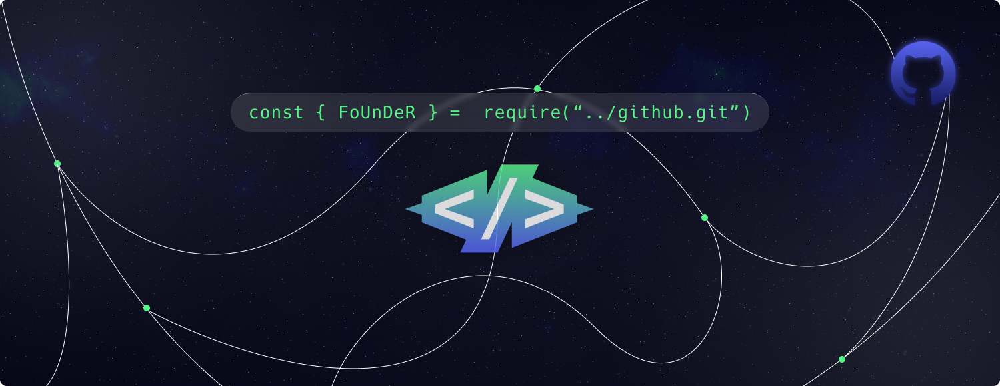

#  

# Who am I?
> My name is `Ranumitha`, Sailing from [Sri Lanka](https://en.wikipedia.org/wiki/Sri_Lanka) as a _15 year old_ full-stack developer. My hobbies often revolve around programming, sports, and other life activities. I have five rabbits and two turtles to provide love and care for them which relax my mind. Loves listening to pop music, here's [my 2024 spotify playlist](https://open.spotify.com/playlist/1y4DzCJVfeCzMk3VqNJaH1?si=eb1e8518c9f349e1&nd=1&dlsi=d3b0aa40ca654613). 

> I used to be a small content creator back in the day, but now I'm smashing keyboard keys to develop experiences and play games for fun. I might rework on my YouTube channel in the future, who knows :shipit:. Making discord apps using discord.js and javascript satisfies me a lot, and by doing that I learn more things about both Discord and javascript.

**Various languages and additional related subjects I'm working with**

**Achievements**
| Name | Year | Description |
|-----:|-----:|-------------|
| School Junior Prefect | 2023 - 2024 | I learned how I can be a pure leader. |
| Discord Senior Community Manager | 2020 - Current | Managing and moderating communities is really joyful. |
| Discord App Developer | 2021 - Current | Seeing the result of something you have developed, is the best moment. |
| Senior Graphic Designer | 2021 - Current | Bringing what we create in our minds to life... |
| Head Prefect of Sunday's School | 2023 - Current | Leading a team and taking part in leadership is what it is |

# **Projects**

International Friendship Society - College-based project to connect and share knowledge with foreigner!

[Discord Insiders](https://discord.gg/cGvgpGTdDU) - Educate yourself about Discord and its components, including new features and frequent small changes, all in one place.

[Rabbit College](https://github.com/rabbit-college/) - A small environment for professional developers & enthusiasts around Discord.

[Datamining Hub](https://github.com/FoUnDeRR/datamining-hub) - Everything for you to know about Datamining and Resources of Discord from scratch.

# Software I use for my work

**IDEs (Integrated Development Environment)**

**Platforms & Interests**

# Contributions

  

# Connect—between you and me
> - <kbd>[Discord](https://discord.com/users/965629616012267570)</kbd>
> - <kbd>[Twitter](https://x.com/JustMightyYeti)</kbd>
> - <kbd>[YouTube](https://www.youtube.com/channel/@JustMightyYetiii)</kbd>
> - <kbd>[Instagram](https://www.instagram.com/itz.mightyyeti/)</kbd>

# Thanks for reading!
- If you read till the bottom, here is a little **[gift](https://youtu.be/ddIYuXHpKpA?si=DUvI32CCVcn3dr1o)** for you, and of course have a great and stellar day! :blue_heart: :shipit:

[octocat source](https://myoctocat.com/build-your-octocat/)
